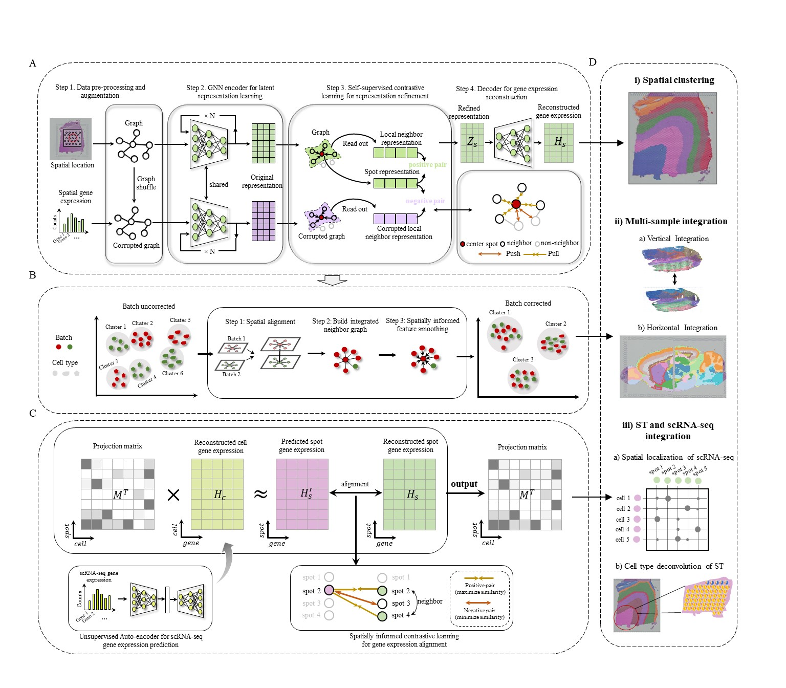

Welcome to GraphST's documentation!
===================================

.. GraphST documentation master file, created by
   sphinx-quickstart on Thu Sep 16 19:43:51 2021.
   You can adapt this file completely to your liking, but it should at least
   contain the root `toctree` directive.

Spatially informed clustering, integration, and deconvolution of spatial transcriptomics with GraphST
=====================================================================================================================================================

.. toctree::
   :maxdepth: 1
   
   Installation
   Tutorial 1_10X Visium
   Tutorial 2_scRNA and ST data integration
   Tutorial 3_Stereo-seq
   Tutorial 4_Horizontal Integration
   Tutorial 5_Vertical Integration

Overview
========
GraphST is a versatile graph self-supervised contrastive learning model that incorporates spatial location information and gene expression profiles to accomplish three key tasks, spatial clustering, spatial transcriptomics (ST) data integration, and single-cell RNA-seq (scRNA-seq) transfer onto ST. GraphST combines graph neural networks (GNNs) with self-supervised contrastive learning to learn spot representations in the ST data by modeling gene expressions and spatial locaiton information. After the representation learning, the non-spatial alignment algorithm is used to cluster the spots into different spatial domains. Each cluster is regarded as a spatial domain, containing spots with similar gene expression profiles and spatially proximate. GraphST can jointly analyze multiple ST samples while correcting batch effects, which is achieved by smoothing features between spatially adjacent spots across samples. For the scRNA-seq transfer onto ST data, a mapping matrix is trained via an augmentation-free contrastive learning mechanism, where the similarity of spatially adjacent spots are maximized while those of spatially non-adjacent spots are minimized. With the learned mapping matrix, arbitrary cell attributes (e.g., cell type and sample type) can be flexibly projected onto spatial space.

Citation
========
Long et al. Spatially informed clustering, integration, and deconvolution of spatial transcriptomics with GraphST. **Nature Communications**. 14(1), 1155 (2023)

